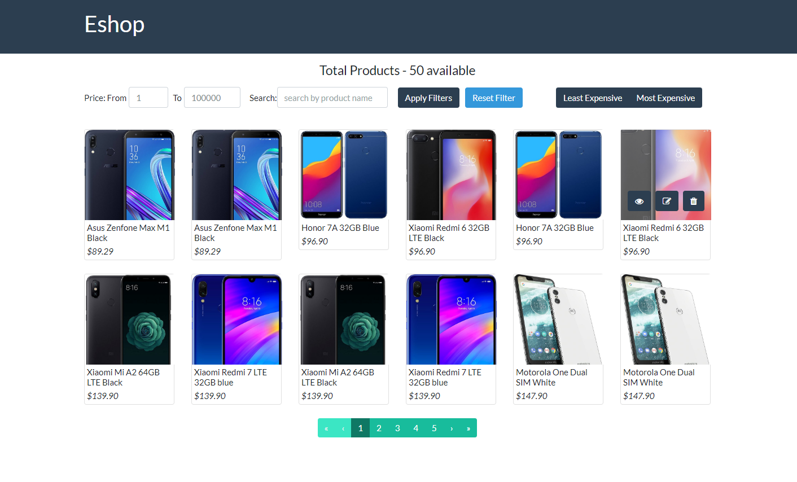

# Eshop

Eshop is a simple app demonstrating key features of asp.net core used with angular. Developed with a mixture of clean DDD arhitecture.

- FE - Angular SPA
- BE - Asp.net core

## Start Up Main Project

- Open with  Visual Studio 2019 (or C# version >= 7.1), .net core >= 2.0
- Set Start Up Project to WebApi
- Debug Project in Debug/Release mdoe

## Start-up links
- SPA - http://localhost:5001/
- Swagger - http://localhost:5001/swagger/index.html

## Start-up Unit Tests
- Open UnitTests project
- Open test explorer on Visual Studio
- Click run all/debug all

## Contributing
Pull requests are welcome. For major changes, please open an issue first to discuss what you would like to change.

Please make sure to update tests as appropriate.